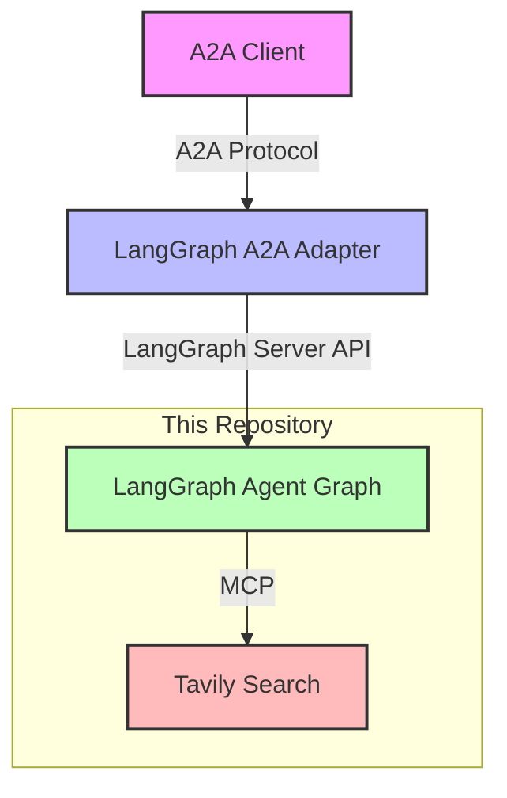

# LangGraph A2A MCP Example

This repository demonstrates how to build an [A2A Protocol](https://google.github.io/A2A/)-compatible application using [LangGraph](https://github.com/langchain-ai/langgraph) with Multi-Channel Protocol ([MCP](https://github.com/langchain-ai/langchain-mcp-adapters)) capabilities.

## Architecture



## Overview

[LangGraph](https://github.com/langchain-ai/langgraph) is a library for building stateful, multi-actor applications with LLMs. This example shows how to create a LangGraph application that is compatible with the A2A (Agent-to-Agent) Protocol, enabling it to communicate with any A2A-compatible client.

Key features:
- **A2A Protocol Support**: Seamless integration with A2A-compatible clients through the adapter
- **Multi-Channel Protocol (MCP)**: Support for structured communication between AI systems using [LangChain MCP Adapters](https://github.com/langchain-ai/langchain-mcp-adapters)
- **Stateful Conversation**: Built-in support for persistent state, checkpoints, and multi-step interactions
- **Human-in-the-Loop**: Capability for both autonomous operation and human collaboration

## Setup Requirements

You'll need to set up two components:

1. **This LangGraph application** - The actual agent implementation
2. **LangGraph A2A Adapter** - Translates between A2A protocol and LangGraph API ([GitHub repo](http://github.com/n-sviridenko/langgraph-a2a-adapter))

### 1. Setting up the LangGraph Application

1. Clone the repository:
   ```bash
   git clone <repository-url>
   cd langgraph-a2a-mcp-example
   ```

2. Create and activate a virtual environment:
   ```bash
   python -m venv venv
   source venv/bin/activate  # On Windows: venv\Scripts\activate
   ```

3. Install dependencies:
   ```bash
   pip install -r my_agent/requirements.txt
   ```

4. Create a `.env` file with your API keys:
   ```bash
   cp .env.example .env
   ```
   Then add your API keys for Anthropic, Tavily, and OpenAI.

### 2. Setting up the A2A Adapter

1. Clone the adapter repository:
   ```bash
   git clone https://github.com/n-sviridenko/langgraph-a2a-adapter.git
   cd langgraph-a2a-adapter
   ```

2. Follow the installation instructions in the adapter's README.

3. Create a `.env` file with the following configuration:
   ```sh
   # LangGraph Connection
   LANGGRAPH_API_URL=http://localhost:2024
   
   # A2A Server Configuration
   A2A_PUBLIC_BASE_URL=http://localhost:8000
   A2A_PORT=8000
   
   # Agent Card Configuration
   AGENT_NAME="Weather Assistant"
   AGENT_DESCRIPTION="An AI assistant that provides weather information, forecasts, and related climate data."
   AGENT_VERSION=1.0.0
   AGENT_SKILLS='[{"id":"weather_info","name":"Weather Information","description":"Get current weather conditions for any location","examples":["What\'s the weather like in New York?","Is it raining in London right now?"]},{"id":"weather_forecast","name":"Weather Forecast","description":"Get weather forecasts for upcoming days","examples":["What\'s the forecast for Tokyo this weekend?","Will it snow in Chicago next week?"]}]'
   ```

## Running the System

1. Start the LangGraph application:
   ```bash
   langgraph dev
   ```

2. In a separate terminal, start the A2A adapter:
   ```bash
   cd langgraph-a2a-adapter
   python main.py
   ```

3. Connect any A2A-compatible client to the adapter at `http://localhost:8000`. You can use the [Google A2A Demo Web App](https://github.com/google/A2A/blob/main/demo/README.md) for testing.

## A2A Integration

The A2A adapter provides:

- Agent discovery through standard A2A agent cards
- Message exchange with assistants
- Task management 
- Streaming responses
- Push notifications for task updates

## Deployment

In order to deploy this agent to LangGraph Cloud you will want to first fork this repo. After that, you can follow the instructions [here](https://langchain-ai.github.io/langgraph/cloud/) to deploy to LangGraph Cloud.

For the A2A Adapter, see the deployment instructions in its repository.
